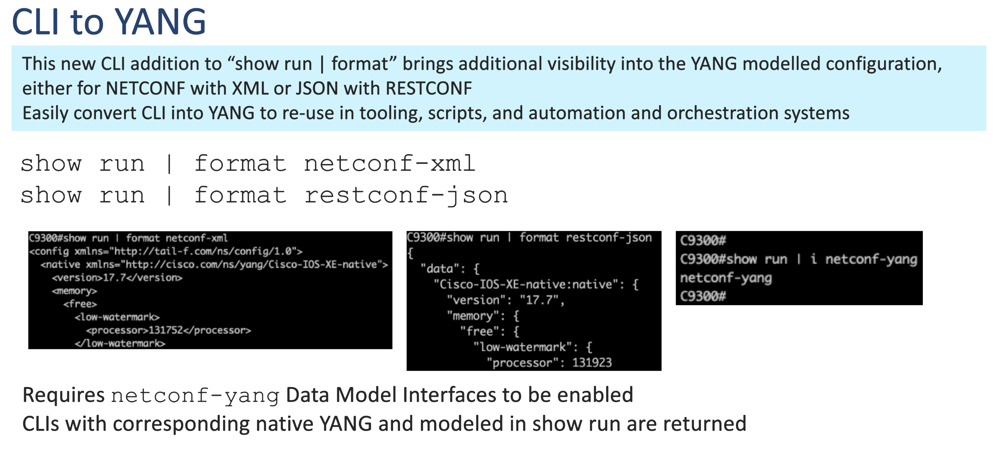
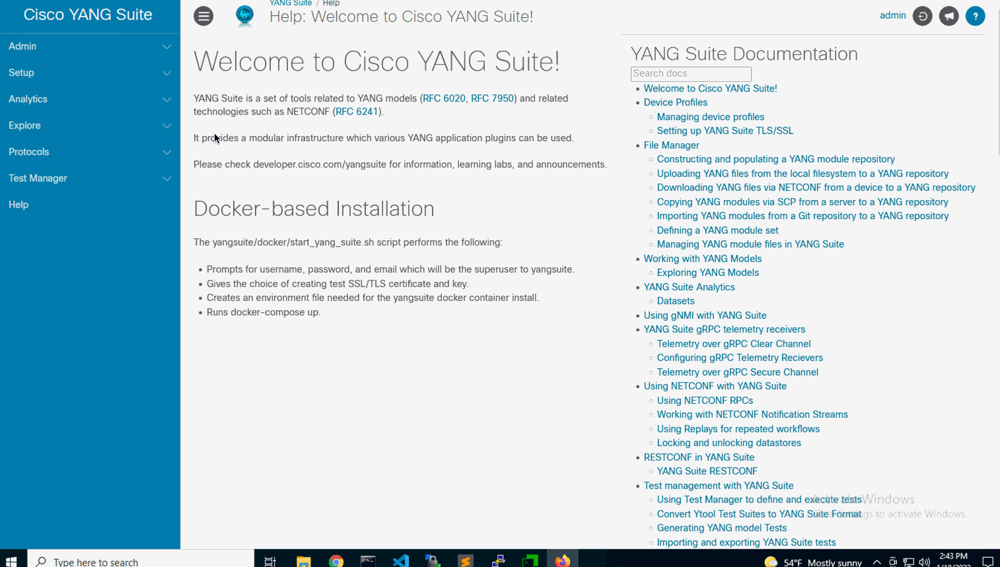

<a href="https://terraform.io">
    
</a>

# Terraform Provider for Cisco IOS XE

The terraform-provider-iosxe is a plugin for Terraform that one can use to manage the configuration and state on Cisco Catalyst IOS XE devices including switches, routers, and wireless LAN controllers.

The provider was build and tested with Cisco Catalyst IOS XE and all subsequent releases are supported
- Cisco IOS XE 17.7

## Getting Started

- [Using the provider](docs/index.md)
- [Provider development](./DEVELOPMENT.md)
- [Intro to IOS XE slides](docs/resources/intro_to_terraform_video.pdf)


The primary usecase for the Cisco IOS XE provider is managing the following features:

| Features examples: |  |  |  |  | 
| ---- | ---- |---- |---- |---- |
| [aaa-authentication](./examples/examples_tf/aaa-authentication.tf)  | [aaa-authorization](./examples/examples_tf/aaa-authorization.tf)  | [aaa-accounting](./examples/examples_tf/aaa-accounting.tf)  | [acl](./examples/examples_tf/acl.tf)  | [bgp](./examples/examples_tf/bgp.tf)  |
| [cdp](./examples/examples_tf/cdp.tf)  | [dhcp](./examples/examples_tf/dhcp.tf)  | [emp](./examples/examples_tf/emp.tf)  | [etherChannel](./examples/examples_tf/etherChannel.tf)  | [hsrp](./examples/examples_tf/hsrp.tf)  
| [igmp](./examples/examples_tf/igmp.tf)  | [igmp-proxy](./examples/examples_tf/igmp-proxy.tf)  | [l3-subinterface](./examples/examples_tf/l3-subinterface.tf)  | [line](./examples/examples_tf/line.tf)  | [mdt](./examples/examples_tf/mdt.tf)  |
| [nat](./examples/examples_tf/nat.tf)  | [ntp](./examples/examples_tf/ntp.tf)  | [ospf](./examples/examples_tf/ospf.tf)  | [pim](./examples/examples_tf/pim.tf)  | [poe](./examples/examples_tf/poe.tf)  | 
| [radius](./examples/examples_tf/radius.tf)  | [snmp](./examples/examples_tf/snmp.tf)  | [span-rspan](./examples/examples_tf/span-rspan.tf)  | [vlan](./examples/examples_tf/vlan.tf)  | [vlan-trunk](./examples/examples_tf/vlan-trunk.tf)  | 
| [vlan-voice](./examples/examples_tf/vlan-voice.tf)  | [vtp](./examples/examples_tf/vtp.tf) | [ipsec crypto tunnel](./examples/examples_tf/crypto-tunnel.tf) |

## Creating Additional Terraform Resources
Any feature or Remote Procedure Call (RPC) supported by RESTCONF & YANG is supported by this Terraform provider. If a particular feature example is not yet in this GitHub repository, you can create the necessary Terraform file using these steps
1.	Configure the feature as per the CLI config guide, if needed.
1.	You can find the JSON for features currently configured device using `show run | format restconf-json` 
    -	An alternate approach to find the RESTCONF JSON can be done using [YANG Suite](https://github.com/CiscoDevNet/yangsuite), a tool to visualize and understand YANG models
    
1.  The resulting JSON found from executing RESTCONF can be used to create the .tf file. For example, replace each of the values in angle brackets (<>) in the example Terraform file below with the corresponding Xpath and JSON:

    example.tf
    ```
    resource "iosxe_rest" "feature_put" {
        method = "PUT"
        path   = <RESTCONF_XPATH>
        payload = jsonencode(    
            {
                <JSON_RESPONSE>
            }
        )
    }
    ```
