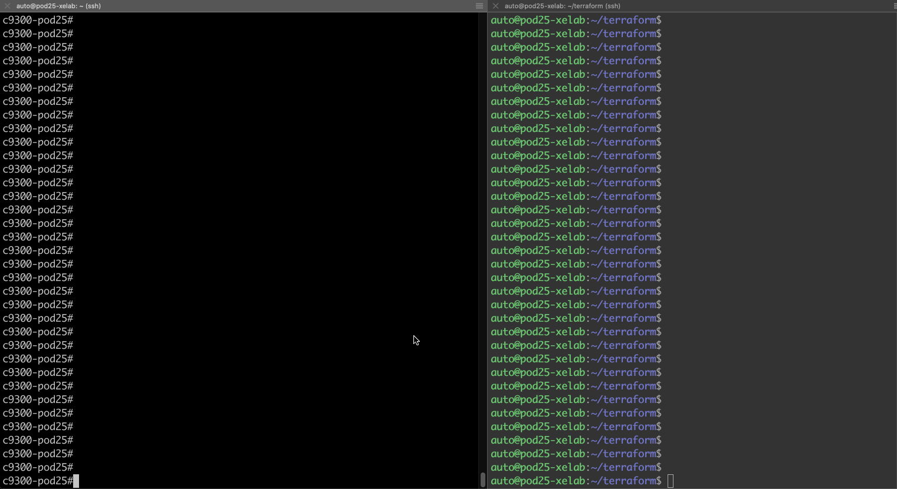

## Add an ACL a VLAN using Terraform
Use the [simplified_acl_and_vlan.tf](simplified_acl_and_vlan.tf) file to configure an ACL and a VLAN on a Catalyst 9300 switch. 

1. Ensure Terraform is installed
1. Configure RESTCONF on the switch 
    ```
    configure terminal
    restconf 
     ```
1. Initialize Terraform from a host
   ```
   terraform init
   ``` 
1. Apply the JSON within the terraform file
   ```
   terraform apply -auto-approve
   ```

See an example terraform file to configure an ACL and a VLAN

